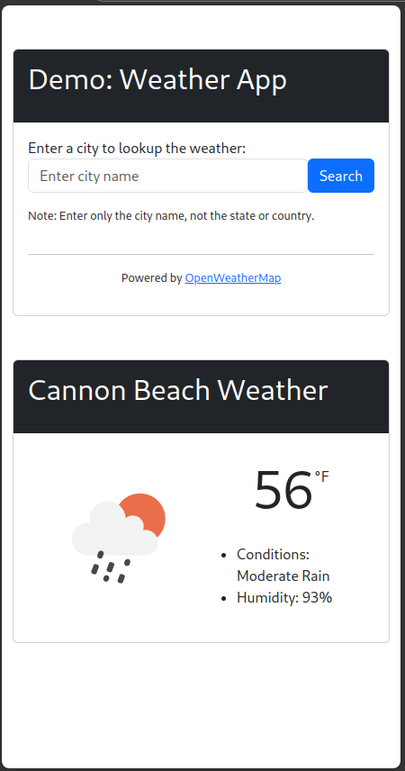
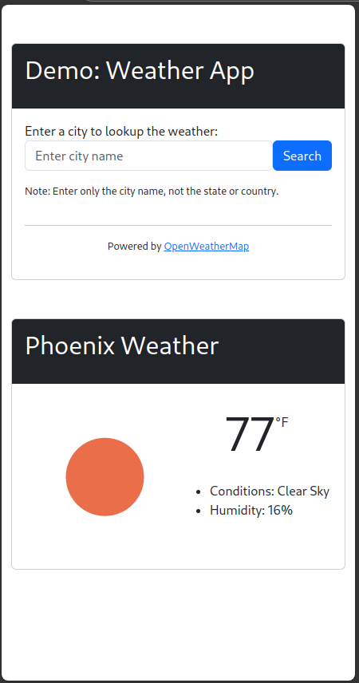
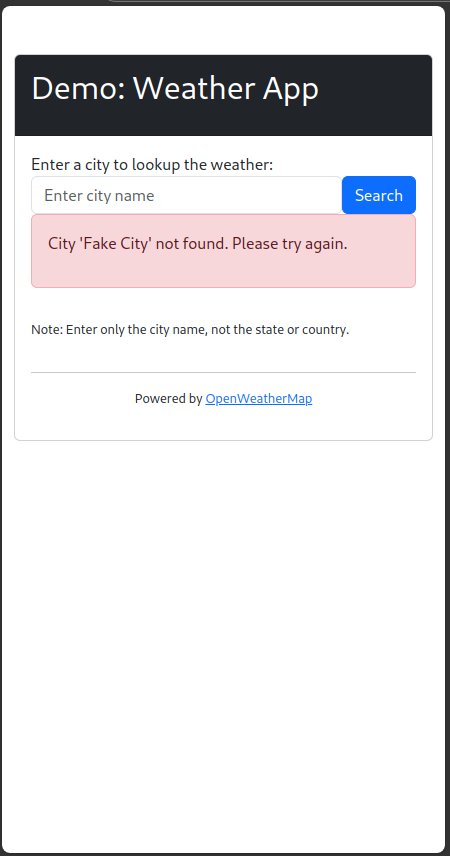

# Weather App Demo

A small, demo app that fetches and displays real-time weather data for a specified city.
- Uses the [OpenWeatherMap](https://home.openweathermap.org/) API as the data source.

---

- [Weather App Demo](#weather-app-demo)
  - [About](#about)
  - [Setup](#setup)
  - [Usage](#usage)
  - [Demo](#demo)
  - [Contact](#contact)

---

## About

This project demonstrates a basic Flask web application that retrieves real-time weather data from the OpenWeatherMap API. The app features a single page with a form where users can input a city name. Upon submission, the app fetches and displays the current weather data for the specified city.

Built with Flask, this project showcases how to interact with a third-party RESTful API to fetch and process data. The frontend is created using HTML and Jinja templating, while the backend handles the API requests and data display.

---

## Setup

1. Clone the repo.
    ```
    git clone https://github.com/cmorman/weather-app
    ```
2. Change directory:
    ```
    cd weather-app
    ```
3. Install dependencies:
    ```
    pip install -r requirements.txt
    ```
4. Enter your API key:
    ```
    echo "API_KEY = <replace-with-your-api-key>" > .env
    ```
    > [!IMPORTANT]
    > - Replace `<your_api_key_here>` with your actual [API key](https://home.openweathermap.org/api_keys).

    > [!NOTE]
    > - Create a free account at [OpenWeatherMap](https://home.openweathermap.org/users/sign_up) is required to obtain an [API key](https://home.openweathermap.org/api_keys).

5. Run the app: 
    ```
    python demo.py
    ```

---

## Usage
1. Navigate to http://127.0.0.1:5000
2. Enter the target city and click "Get Weather"

---

## Demo

Successful searches pull up the current weather data for the target city and an icon representing the current weather conditions.




Unsuccessful searches will display an error message.



---

## Contact

github@cmorman.com