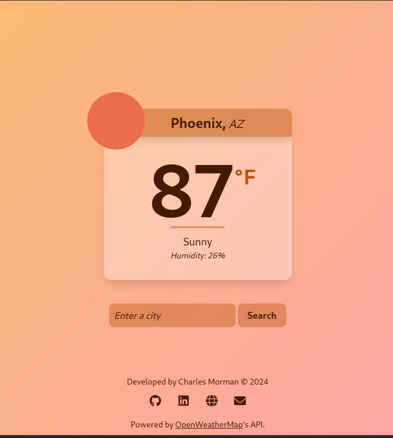
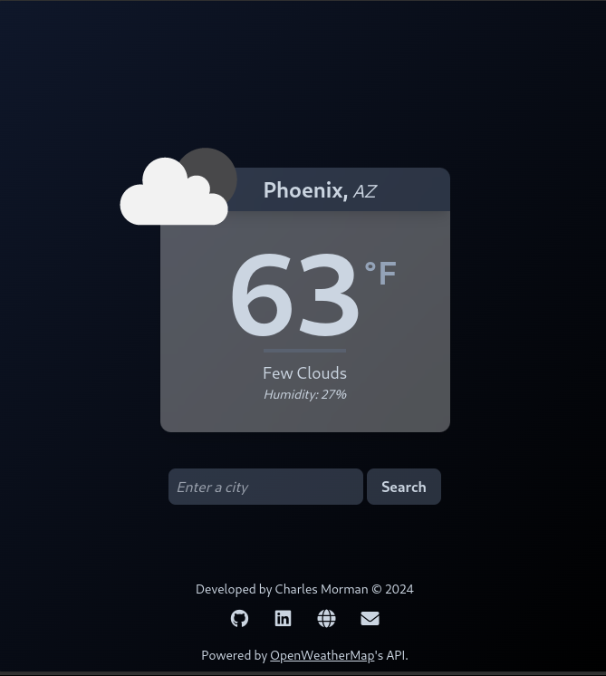

# Weather App Demo

A small, demo app that fetches and displays real-time weather data for a specified city.
- Uses the [OpenWeatherMap](https://home.openweathermap.org/) API as the data source.
- Dynamically themed based on the current weather conditions.


|  |  |
| -- | -- |
| Sunny Day | Cloudy Night |


---

- [Weather App Demo](#weather-app-demo)
  - [About](#about)
  - [Setup](#setup)
  - [Usage](#usage)
  - [Release Notes](#release-notes)
  - [Demo](#demo)
  - [Contact](#contact)

---

## About

This project is a small demo app that fetches and displays real-time weather data for a specified city. The app uses the [OpenWeatherMap](https://home.openweathermap.org/) API as the data source. The app is built using Python, Flask, and HTML/CSS/JS (TailwindCSS).

---

## Setup

1. Clone the repo.
    ```
    git clone https://github.com/cmorman/weather-app
    ```
2. Change directory:
    ```
    cd weather-app
    ```
3. Install dependencies:
    ```
    pip install -r requirements.txt
    ```
4. Enter your API key:
    ```
    echo "API_KEY = <replace-with-your-api-key>" > .env
    ```
    > [!IMPORTANT]
    > - Replace `<your_api_key_here>` with your actual [API key](https://home.openweathermap.org/api_keys).

    > [!NOTE]
    > - Create a free account at [OpenWeatherMap](https://home.openweathermap.org/users/sign_up) is required to obtain an [API key](https://home.openweathermap.org/api_keys).

5. Run the app: 
    ```
    python demo.py
    ```

---

## Usage
1. Navigate to http://127.0.0.1:5000
2. Enter the target city and click "Get Weather"

---

## Release Notes

- ### [v1.0] - 2024-12-19
  - #### Added
    - Unit tests for the backend API calls (mocked).
    - Implement basic Flask backend.
    - Basic HTML frontend with a form to submit a city name.
    - Basic HTML template to display weather data.
    - Integration with OpenWeatherMap API to fetch current weather data.
    - Set up project structure (README.md, CHANGELOG.md, requirements.txt)
    - Document setup and usage instructions in README.md

---

## Demo

Screenshots of the app in action:

|  |  |
| -- | -- |
| Sunny Day | Cloudy Night |

---

## Contact

github@cmorman.com